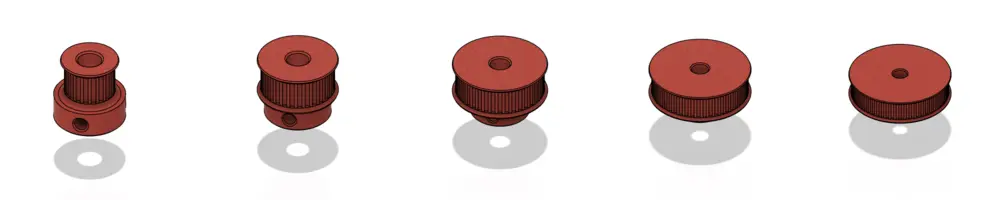

# GT2_Pulley

This project provides parametric models for GT2 timing belt pulleys. The models are customizable and suitable for 3D printing. I had successfully printed and tested these pulleys with ASA CF filament, but other materials may also work.

## Features

- Fully parametric design (number of teeth, bore size, flange options, etc.)
- Compatible with standard GT2 belts (2mm pitch)
- Source files for easy modification

## Getting Started

### Prerequisites

- [Fusion 360](https://www.autodesk.com/products/fusion-360/overview) (for editing and exporting models)

### Usage

1. Clone this repository:
    ```bash
    git clone https://github.com/Zergie/GT2_Pulley.git
    ```
2. Open the `CAD\GT2_Pulley.f3d` file in Fusion 360.
3. Adjust parameters as needed (number of teeth, bore diameter, etc.).
4. Export as STL or STEP for 3D printing.

### Batch Usage 

1. Clone this repository:
    ```bash
    git clone https://github.com/Zergie/GT2_Pulley.git
    cd GT2_Pulley
    git submodule update --init --recursive
    ```
2. Install wsl and choose a distribution (e.g., Ubuntu):
    ```bash
    wsl --install
    ```
4. Enter the WSL environment:
    ```bash
    wsl
    ```
3. Install the required packages:
    ```bash
    apt update
    apt install python3 make
    cd FusionHeadless
    make
    cd ..
    ```
4. Open the `CAD\GT2_Pulley.f3d` file in Fusion 360.
5. Find the File-Id of the GT2_Pulley.f3d file in Fusion 360:
    ```bash
    FusionHeadless/.venv/bin/python FusionHeadless/send.py --get /files?active=true
    ```
    The File-Id will be displayed as the first ID in the output. It should look like `urn:adsk.wipprod:dm.lineage:...`.
6. Edit the Makefile in `GT2_Pulley` directory to set your File-Id and desired parameters.
7. Run the batch script to generate pulleys:
    ```bash
    make
    ```

## Contributing

Pull requests are welcome. For major changes, please open an issue first to discuss what you would like to change.

## Links

- [GT2 Belt Calculator](https://www.wantabelt.de/en/timing-belt/calculation-program/belt-length-calculator-for-timing-belts-2)
